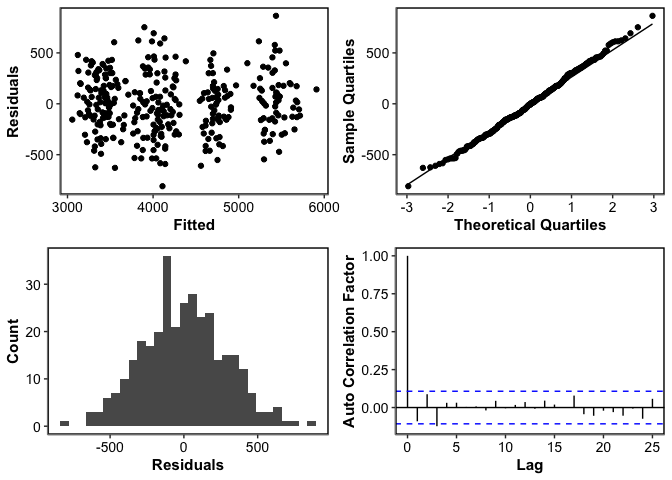
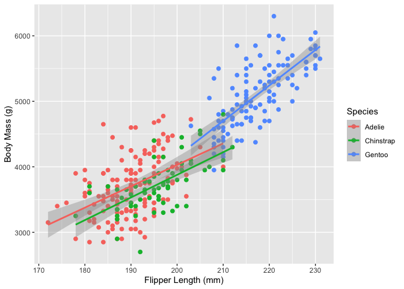
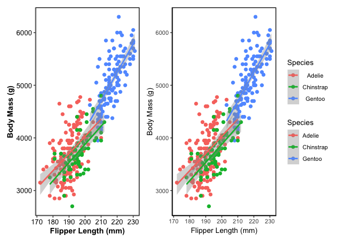
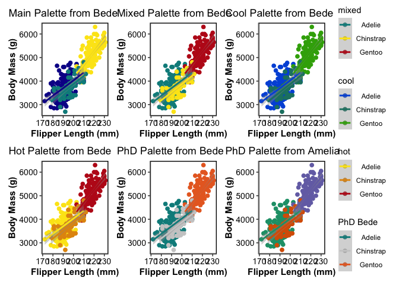

<!-- README.md is generated from README.Rmd. Please edit that file -->

# MBERCr 

Primarily, MBERCr is a package of simple utility features for data
manipulation and simple statistics. It also contains personalisable
palettes and themes for ggplot2 plots. Plus, any random crap that Molly
adds.

## Installation

You can install the development version of MBERCr from
[Github](https://https://github.com) with:

``` r
install.packages("devtools")

devtools::install_github("MBERC/MBERCr")
```

## Features

Before showing the features we need to gather some data to be able to
look at the functions of the package. To do this we will first of all
load some packages (all available from
[CRAN](https://CRAN.R-project.org) apart from MBERCr).

### Data Creation

``` r
library(marmap)
library(tidyverse)
library(sf)
library(lme4)
library(MBERCr)
library(mapdata)
library(maps)
library(palmerpenguins)
library(patchwork)
```

Once the packages are loaded we can then start getting our data ready
for the examples. For some example data we will grab the Palmer Penguins
data then also get some bathymetry data from the marmap package that
extracts bathymetry from the NOAA databases.

``` r
# get palmer penguins df
data(package = 'palmerpenguins')


df<-penguins

# get bathymetry data

b <- getNOAA.bathy(lon1 = 160, lon2 = 180, lat1 = -28.5, lat2 = -49.2,
                  resolution = 5)

# convert bathymetry matrix to spatial object

B <- as.SpatialGridDataFrame(b)

# convert spatial object to special features

sf_bathy <- st_as_sf(B) %>%
  dplyr::filter(layer<0.1)

# get land outline 

nz <- map_data("nz")
```

### Simple data cleaning

However, brilliant your data are there will often be NA values.
Sometimes this is fine but specific columns may be used for analysis
later and inclusion of NA’s might therefore be a nuisance. We can use
the *completeFun()*, where we define the dataframe to use and then the
column/s we want to check to remove rows if they contain NAs.

``` r
head(df)
#> # A tibble: 6 × 8
#>   species island bill_length_mm bill_depth_mm flipper_length_… body_mass_g sex  
#>   <fct>   <fct>           <dbl>         <dbl>            <int>       <int> <fct>
#> 1 Adelie  Torge…           39.1          18.7              181        3750 male 
#> 2 Adelie  Torge…           39.5          17.4              186        3800 fema…
#> 3 Adelie  Torge…           40.3          18                195        3250 fema…
#> 4 Adelie  Torge…           NA            NA                 NA          NA <NA> 
#> 5 Adelie  Torge…           36.7          19.3              193        3450 fema…
#> 6 Adelie  Torge…           39.3          20.6              190        3650 male 
#> # … with 1 more variable: year <int>

# remove rows where sex is NA 

df2<-MBERCr::completeFun(df,"sex")

head(df2)
#> # A tibble: 6 × 8
#>   species island bill_length_mm bill_depth_mm flipper_length_… body_mass_g sex  
#>   <fct>   <fct>           <dbl>         <dbl>            <int>       <int> <fct>
#> 1 Adelie  Torge…           39.1          18.7              181        3750 male 
#> 2 Adelie  Torge…           39.5          17.4              186        3800 fema…
#> 3 Adelie  Torge…           40.3          18                195        3250 fema…
#> 4 Adelie  Torge…           36.7          19.3              193        3450 fema…
#> 5 Adelie  Torge…           39.3          20.6              190        3650 male 
#> 6 Adelie  Torge…           38.9          17.8              181        3625 fema…
#> # … with 1 more variable: year <int>
```

## Model Assessments

Often we use regression models to assess data. If we want to check the
assumptions of these models the base r functions suck. There are good
packages to check these assumptions () but we also have another here.

``` r
mod1<-lm(body_mass_g~.,data=df2)

Model_Check(mod1)
#> `stat_bin()` using `bins = 30`. Pick better value with `binwidth`.
```



## Data Visualisation

In MBERCr we have many functions to make figures look nicer (*we
thing*). Lets do a basic plot.

``` r
ggplot(data = df2, aes(x = flipper_length_mm, y = body_mass_g)) +
  geom_point(aes(color = species),
             size = 2)+
  geom_smooth(aes(color=species),method = "lm")+
  labs(x="Flipper Length (mm)",
       y="Body Mass (g)",
       color="Species")
#> `geom_smooth()` using formula 'y ~ x'
```



Now lets make the theme look better.

``` r
themeplot1<-ggplot(data = df2, aes(x = flipper_length_mm, y = body_mass_g)) +
  geom_point(aes(color = species),
             size = 2)+
  geom_smooth(aes(color=species),method = "lm")+
  labs(x="Flipper Length (mm)",
       y="Body Mass (g)",
       color="Species")+
  theme_Bede()

themeplot2<-ggplot(data = df2, aes(x = flipper_length_mm, y = body_mass_g)) +
  geom_point(aes(color = species),
             size = 2)+
  geom_smooth(aes(color=species),method = "lm")+
  labs(x="Flipper Length (mm)",
       y="Body Mass (g)",
       color="Species")+
  theme_Amelia() 

themeplot1+themeplot2+plot_layout(guides="collect")
#> `geom_smooth()` using formula 'y ~ x'
#> `geom_smooth()` using formula 'y ~ x'
```



Okay that is better but lets make the colours nicer.

``` r
colourplot1<-ggplot(data = df2, aes(x = flipper_length_mm, y = body_mass_g)) +
  geom_point(aes(color = species),
             size = 2)+
  geom_smooth(aes(color=species),method = "lm")+
  labs(x="Flipper Length (mm)",
       y="Body Mass (g)",
       color="main",
       title="Main Palette from Bede")+
  theme_Bede()+
  scale_colour_Bede("main")

colourplot2<-ggplot(data = df2, aes(x = flipper_length_mm, y = body_mass_g)) +
  geom_point(aes(color = species),
             size = 2)+
  geom_smooth(aes(color=species),method = "lm")+
  labs(x="Flipper Length (mm)",
       y="Body Mass (g)",
       color="mixed",
       title="Mixed Palette from Bede")+
  theme_Bede()+
  scale_colour_Bede("mixed")

colourplot3<-ggplot(data = df2, aes(x = flipper_length_mm, y = body_mass_g)) +
  geom_point(aes(color = species),
             size = 2)+
  geom_smooth(aes(color=species),method = "lm")+
  labs(x="Flipper Length (mm)",
       y="Body Mass (g)",
       color="cool",
       title="Cool Palette from Bede")+
  theme_Bede()+
  scale_colour_Bede("cool")

colourplot4<-ggplot(data = df2, aes(x = flipper_length_mm, y = body_mass_g)) +
  geom_point(aes(color = species),
             size = 2)+
  geom_smooth(aes(color=species),method = "lm")+
  labs(x="Flipper Length (mm)",
       y="Body Mass (g)",
       color="hot",
       title="Hot Palette from Bede")+
  theme_Bede()+
  scale_colour_Bede("hot")

colourplot5<-ggplot(data = df2, aes(x = flipper_length_mm, y = body_mass_g)) +
  geom_point(aes(color = species),
             size = 2)+
  geom_smooth(aes(color=species),method = "lm")+
  labs(x="Flipper Length (mm)",
       y="Body Mass (g)",
       color="PhD Bede",
       title="PhD Palette from Bede")+
  theme_Bede()+
  scale_colour_Bede("PhD")

colourplot6<-ggplot(data = df2, aes(x = flipper_length_mm, y = body_mass_g)) +
  geom_point(aes(color = species),
             size = 2)+
  geom_smooth(aes(color=species),method = "lm")+
  labs(x="Flipper Length (mm)",
       y="Body Mass (g)",
       color="PhD Amelia",
       title="PhD Palette from Amelia")+
  theme_Bede()+
  scale_colour_Amelia("PhD")


colourplot1+colourplot2+
  colourplot3+colourplot4+
  colourplot5+colourplot6+plot_layout(guides="collect")
```



There also a few colours palettes for gradients.

``` r
ggplot()+
  geom_sf(data=sf_bathy,mapping=aes(colour=layer))+
  geom_polygon(data = nz, aes(x = long, y = lat, group = group),
               fill = "forestgreen", colour = "black",alpha=0.4)+
  scale_colour_Bede(name="Depth",'Bathy_Blues',discrete=FALSE,reverse=TRUE)+
  theme_Bede()+
  labs(x="Longitude",
       y="Latitude")
```


## Fin. 
